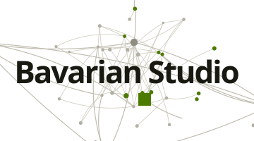

<picture>
  <source media="(prefers-color-scheme: dark)" srcset="./bavarianstudio_logo_lockup_ruhend_dunkel.svg">
  
</picture>

# Bavarian Studio

An AI studio in Munich. One person, 11 named agents — and the products built
and operated with them.

**[studio.bavarian.app](https://studio.bavarian.app)** ·
**[AI consulting](https://studio.bavarian.app/en/ki-beratung/)** — executive
briefings for management and division heads, from someone who works this way
himself.

## How the work runs

11 agents, one point of contact. **Max** (management) takes work in by
messenger, distributes it to the specialists, coordinates the execution and
reports the result back:

| | | |
|---|---|---|
| **Ludwig** — coding | **Josef** — DevOps | **Klara** — support |
| **Bruno** — legal & compliance | **Karl** — finance | **Hans** — sales |
| **Lena** — marketing | **Felix** — growth | **Anna** — content |
| **Gisela** — training data | | |

## What runs on it

**[LearnBavarian](https://learn.bavarian.app)** — learning Bavarian, with
dialect characters. Multilingual, extensively tested, operated in the EU. It
carries its own reviewing agent for dialect quality, and the dialogue
characters inside the app itself.

## Why "bavariacoin"?

Hands-on blockchain technology since 2009: own servers, mining, staking and
masternode infrastructure across dozens of networks, plus contributions to
coin development in various crypto projects. That was technology work rather
than market speculation. The account name stays because those years are part
of the record — and the pattern is the same one: take a new technology
seriously early. This time it is AI.

## Contact

Outbound only — you decide whether a conversation starts:
[hello@studio.bavarian.app](mailto:hello@studio.bavarian.app) ·
[WhatsApp](https://wa.me/491738676604)

Deutsch: [studio.bavarian.app/de/](https://studio.bavarian.app/de/)
