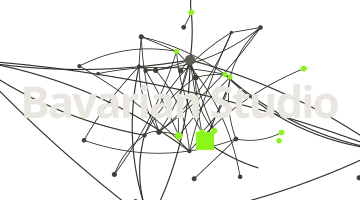

<picture>
  <source media="(prefers-color-scheme: dark)" srcset="./bavarianstudio_logo_lockup_ruhend_hell.svg">
  
</picture>

# Bavarian Studio

KI-Studio aus München. Ein Mensch, 11 benannte Agenten — und Produkte, die
damit gebaut und betrieben werden.

**[studio.bavarian.app](https://studio.bavarian.app)** ·
**[KI-Beratung](https://studio.bavarian.app/de/ki-beratung/)** — Executive
Briefings für Geschäftsführung und Bereichsleitung, von jemandem, der selbst
so arbeitet.

## Wie hier gearbeitet wird

11 Agenten, ein Ansprechpartner. **Max** (Management) nimmt Aufträge per
Messenger entgegen, verteilt sie an die Fachagenten, koordiniert die
Ausführung und meldet das Ergebnis zurück:

| | | |
|---|---|---|
| **Ludwig** — Coding | **Josef** — DevOps | **Klara** — Support |
| **Bruno** — Recht & Compliance | **Karl** — Finanzen | **Hans** — Vertrieb |
| **Lena** — Marketing | **Felix** — Growth | **Anna** — Content |
| **Gisela** — Trainingsdaten | | |

## Was damit läuft

**[LearnBavarian](https://learn.bavarian.app)** — Bayerisch lernen, mit
Dialekt-Charakteren. 10 Sprachversionen, über 2.900 automatisierte Tests,
betrieben in der EU. Dazu ein eigener Prüf-Agent für die Dialektqualität und
die Dialog-Charaktere in der App selbst.

## Warum „bavariacoin"?

Seit 2009 Blockchain-Technologie aus eigener Hand: eigene Server, Mining,
Staking- und Masternode-Infrastruktur über Dutzende Netzwerke, dazu Mitarbeit
an Coin-Entwicklungen in verschiedenen Krypto-Projekten. Das war
Technologiearbeit, keine Markt-Spekulation. Der Kontoname bleibt, weil diese
Jahre zum Werdegang gehören — das Muster ist dasselbe: neue Technologie früh
ernst nehmen. Diesmal ist es KI.

## Kontakt

Nur ausgehend — Sie entscheiden, ob ein Gespräch beginnt:
[hello@studio.bavarian.app](mailto:hello@studio.bavarian.app) ·
[WhatsApp](https://wa.me/491738676604)

English: [studio.bavarian.app/en/](https://studio.bavarian.app/en/)
